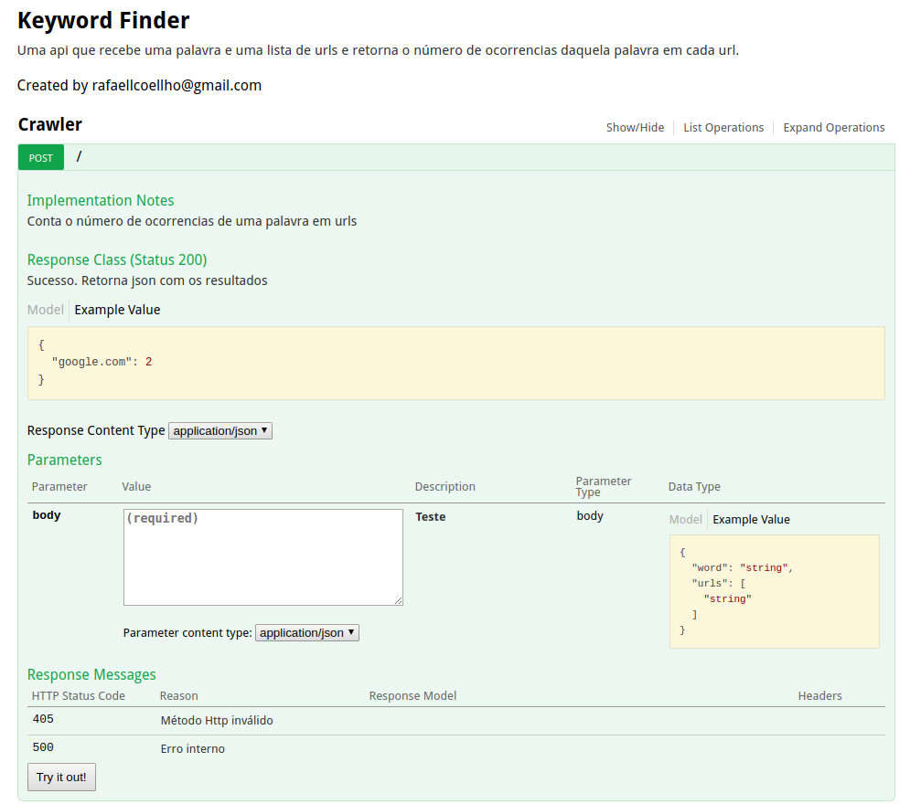
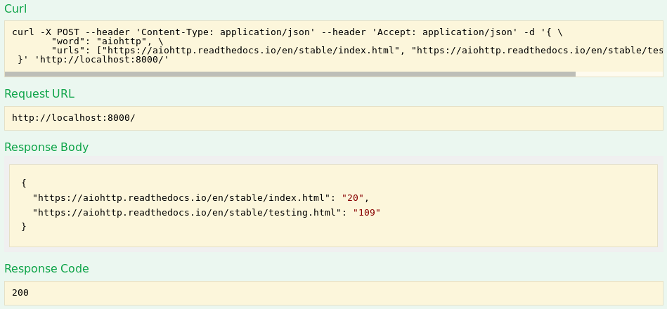

# Keyword Finder 

Uma api que recebe uma palavra e uma lista de urls e retorna o número de ocorrencias daquela palavra em cada url.

## Tecnologias 

* python 3.6
* [aiohttp](https://aiohttp.readthedocs.io/en/stable/index.html)
* [aiohttp-devtools](https://github.com/aio-libs/aiohttp-devtools)
* [aiohttp-swagger](https://github.com/cr0hn/aiohttp-swagger)
* [aioredis](https://github.com/aio-libs/aioredis/)

## Pré-requisitos

* pipenv - [como instalar](https://pipenv.readthedocs.io/en/latest/install/#installing-pipenv)
* redis - [como instalar no fedora](https://computingforgeeks.com/how-to-install-redis-on-fedora-29-fedora-28/), [como instalar usando source code](https://redis.io/download)
 
## Como usar

Após clonar o repositório, instalar as dependências:

```bash
$ pipenv install --dev
```

É importante verificar se o redis está instalado corretamente:

```bash
$ redis-server --version
Redis server v=5.0.4 sha=00000000:0 malloc=jemalloc-5.0.1 bits=64 build=dffd4a7a8e0cd2aa
```

E definir qual o db o redis vai usar. Só ir no pipfile e editar a variável de ambiente __REDIS_DB__. Por default ela é setada pra 0. 

Para rodar em desenvolvimento basta dar um: 

```bash
$ pipenv run dev
```

Em modo de desenvolvimento é possível ver a documentação indo em __localhost:8000/docs__. 

<p align="center">
	<a href="">
		
	</a>
</p>

Para rodar os testes basta dar um:

```bash
$ pipenv run tests
```

Um exemplo de como usar a api: 

```bash
$ curl -X POST --header 'Content-Type: application/json' --header 'Accept: application/json' -d '{"word": "aiohttp", "urls": ["https://aiohttp.readthedocs.io/en/stable/index.html", "https://aiohttp.readthedocs.io/en/stable/testing.html"]}' 'http://localhost:8000/'
{"https://aiohttp.readthedocs.io/en/stable/index.html": "20", "https://aiohttp.readthedocs.io/en/stable/testing.html": "109"}
```

É possível também testar a api usando a própria documentação:

<p align="center">
	<a href="">
		
	</a>
</p>

## Autor 

* **Rafael Coelho** - [rafaellcoellho](https://github.com/rafaellcoellho)
